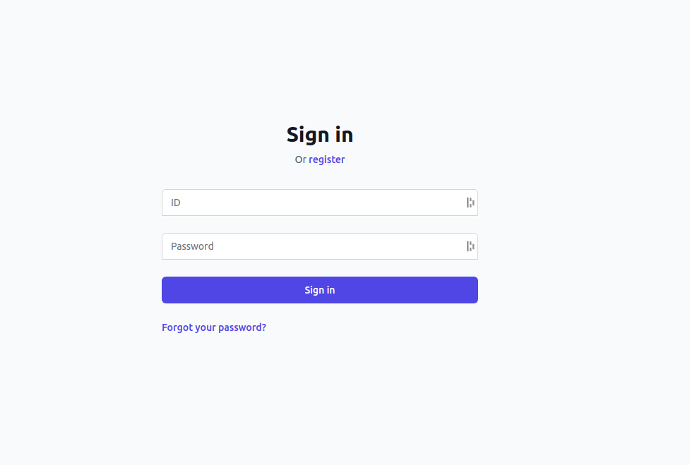
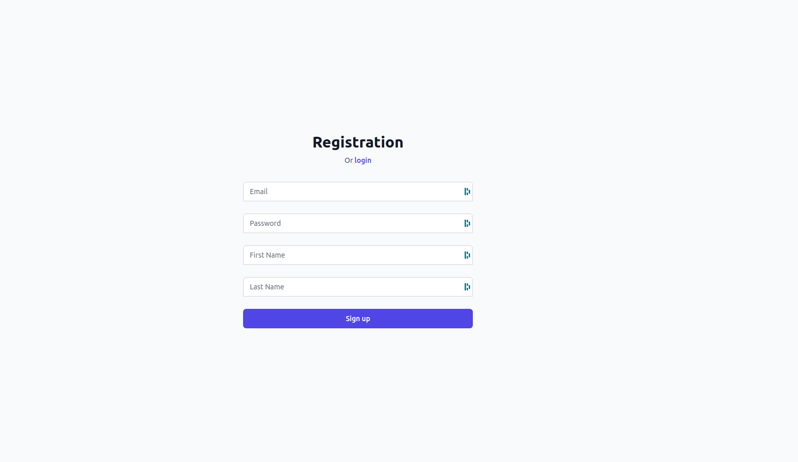
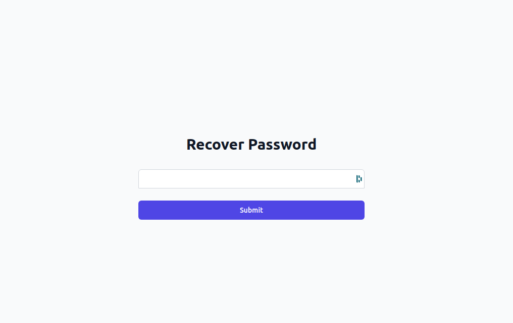
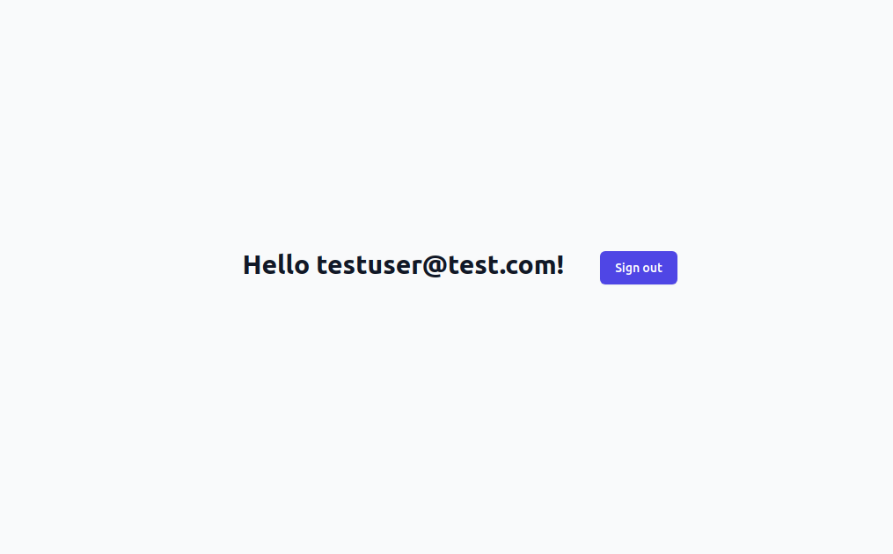

# ReScript React Kratos UI

A SPA (single page application) implementating the browser-based flows for
[kratos.](https://github.com/ory/kratos) Currently, the UI implements login,
logout, registration, and recovery flows.

## Overview

This UI uses the browser flows to implement secure authentication flows. Browser
flows require an initial backend request in order to initiate an authentication
session, this leads to page reloads when visiting `/login` for example. This may
result in a slight flicker, although running locally it's often too fast to nice.
Recently Kratos added support for [ajax](https://github.com/ory/kratos/pull/1367)
flows that works well with SPAs and avoids the need for full page reloads from
backend redirects.

## Tour

### Login
`/login`


### Registration
`/register`


### Recovery
`/recovery`


### Landing
`/`


### Try it yourself

```sh
# Start backends to run UI against. This includes:
#   * Kratos
#   * Postgres - datastore for Kratos data
#   * Mailslurper - a test email server for routing recovery emails
#
# Optionally add `-d` flag in order to detach and run in the background.
docker-compose -f kratos/docker-compose-backends.yaml up --build --force-recreate

# Terminal 1 start ReScript compiler file watcher
npm run re:start

# Terminal 2 start parcel to bundle and serve UI
npm run serve
```
